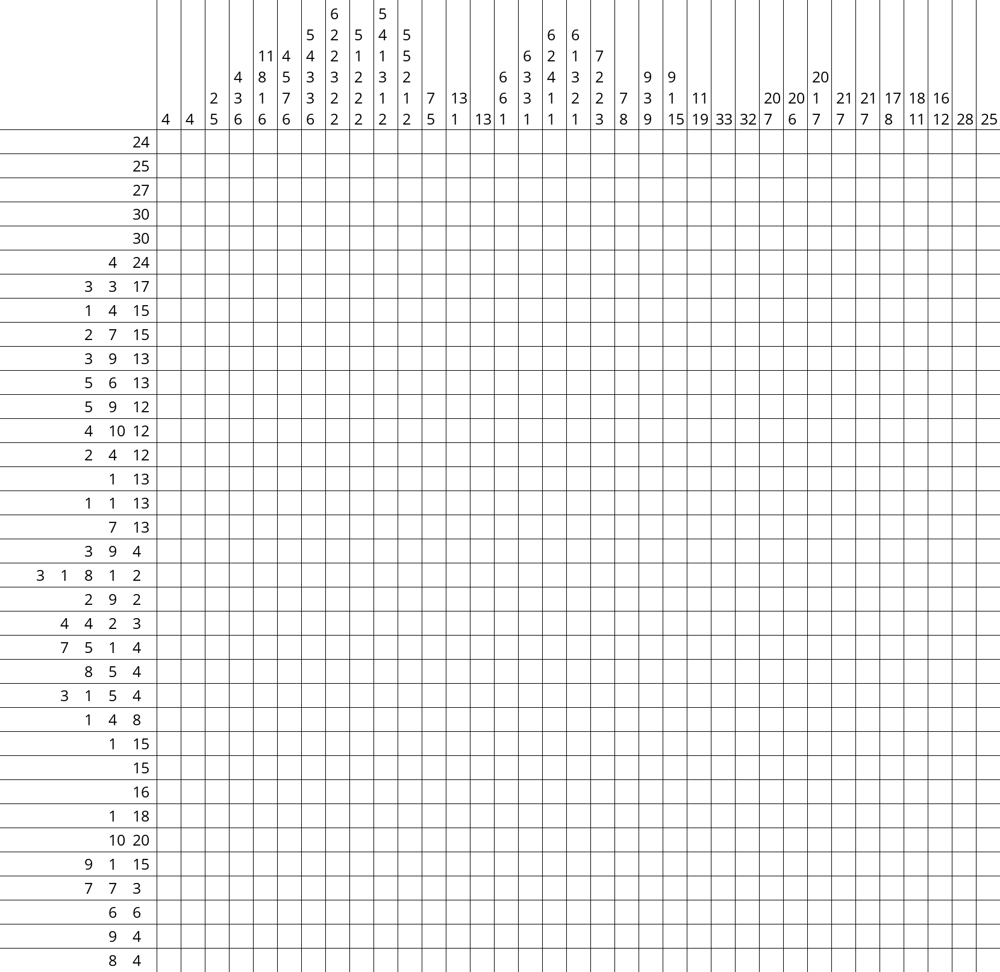

## NonoPy: Nonogram generator for Python
* Based on Python 3 + Pillow
* Includes [Apache Licensed product](http://www.apache.org/licenses/LICENSE-2.0) , Open Sans.

### Dependencies
* Pillow
* NumPy

### Example
```python
import nonogram

#input filename
n = nonogram.Nonogram('example.png')
#width, height, threshold, output filename
n.convert(32, 32, 550, "example")
```

* Input example


* Output example


